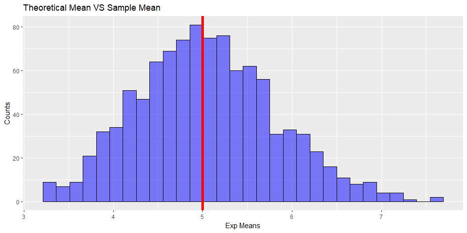
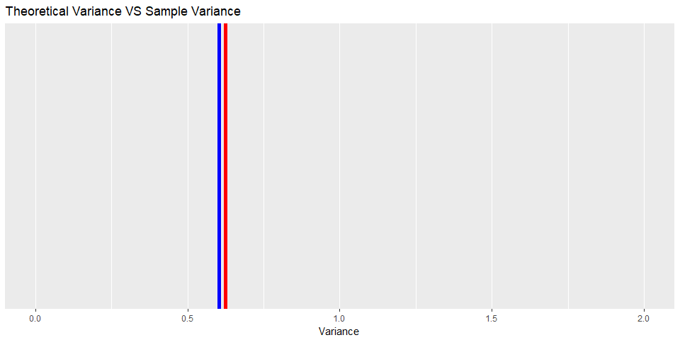
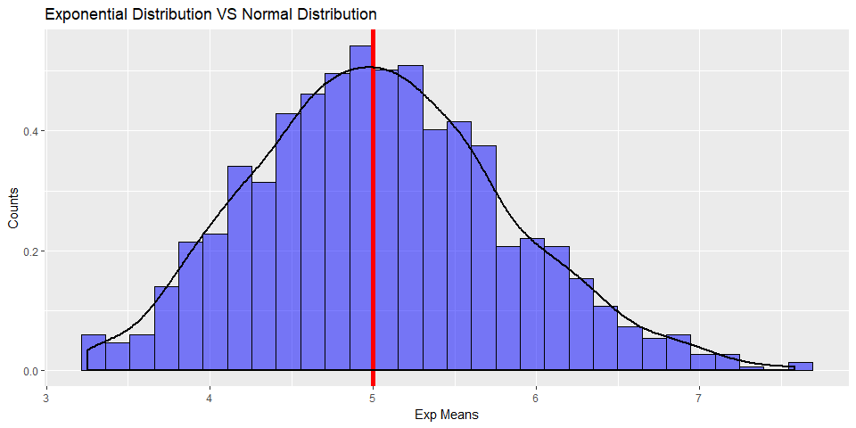

      


## Overview
The aim of this project is to compare the _Exponential Distribution_ and compare it with the _Central Limit Theorem_.This simulations (One thousand) were computated with a lambda = 0.2, distribution averages of 40 exponentials and using the function _rexp()_.


## Simulations
For purposes of reproducibility, is necessary to use a specific seed for all simulations. In this case, 5 will be the seed. The exponential distribution can be simulated in R with rexp(n, lambda) where lambda is the rate parameter (0.2).


```r
lambda <- 0.2
nSimulations <- 1000
n <- 40
exps <- NULL
rows <- seq(1:1000)

set.seed(5)

for (i in rows) exps <- c(exps, mean(rexp(n, lambda)))
samples <- cbind(rows, exps)
sampleDF <- tbl_df(samples)
```

These are the first 5 rows of our 1000 simulations.

1, 2, 3, 4, 5, 4.5934927, 5.637107, 5.5963096, 5.6956886, 4.8900948


## Sample Mean versus Theoretical Mean

The mean of exponential distribution is 1/lambda = 1/0.2 = _5_. This is the theoretical mean taht will be compared to the sample mean.


```r
theoMean <- 1/lambda
sampleMean <- mean(sampleDF$exps)


sampleDF %>% ggplot(aes(x = exps)) +
      geom_histogram(color = "black", fill = "blue", alpha = 0.5) +
      labs(title = "Theoretical Mean VS Sample Mean", x = "Exp Means", y = "Counts") +
      guides(fill = "none", color = "none") +
      geom_vline(xintercept = 5, color = "red", size = 2)
```

```
## `stat_bin()` using `bins = 30`. Pick better value with `binwidth`.
```



Sample Mean: 5.043053

Theoretical Mean: 5

We are close to the theoretical mean as expected from CLT.


## Sample Variance versus Theoretical Variance


The standard deviation of exponential distribution is (1/lambda)/sqrt(n). So its variance is (1/lambda)^2/n.

```r
theoVar <- (1/lambda)^2/n
sampleVar <- var(sampleDF$exps)
sampleDF %>% ggplot() +
      coord_cartesian(xlim = c(0, 2)) + 
      geom_vline(xintercept = theoVar, color = "red", size = 2) +
      geom_vline(xintercept = sampleVar, color = "blue", size = 2) +
      labs(title = "Theoretical Variance VS Sample Variance",
           x = "Variance")
```



Theoretical Variance: 0.625

Sample Variance: 0.6026047

Here, both values are relatively close, so they match with CLT.


## Distribution

### Is Exponential Distribution approximately to Normal Distribution?

It might be already easy to see that exponential has a similar distribution as it is centered. The next figure represents the density of the exponential means.


```r
meanX <- seq(min(sampleDF$exps), max(sampleDF$exps), length.out = nSimulations)
meanY <- density(sampleDF$exps)

normDF <- tbl_df(cbind(meanX, meanY))


sampleDF %>% ggplot(aes(x = exps, y = ..density..)) +
      geom_histogram(color = "black", fill = "blue", alpha = 0.5) +
      labs(title = "Exponential Distribution VS Normal Distribution", x = "Exp Means", y = "Counts") +
      guides(fill = "none", color = "none") +
      geom_vline(xintercept = 5, color = "red", size = 2) +
      geom_density(kernel = "gaussian", size = 1)
```

```
## `stat_bin()` using `bins = 30`. Pick better value with `binwidth`.
```



As it can be seen, the density centered with the theoretical mean.
